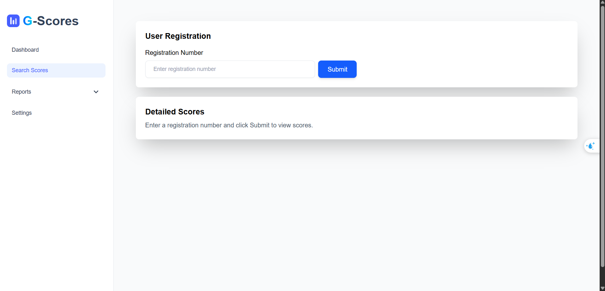
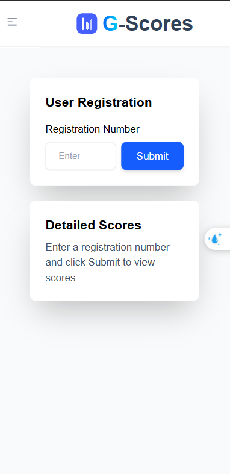

# G-Scores - National High School Exam Score Lookup & Analytics

The G-Scores project is a small web application built to complete the Web Developer Intern assignment for Golden Owl. The application allows users to look up national high school exam scores by registration number, view insightful statistical reports, and list the top 10 students for Group A subjects.

### Live Demo

* **Frontend:** [https://g-scores-application.vercel.app/](https://g-scores-application.vercel.app/)
* **Video Demo:** [Demonstration video](https://drive.google.com/file/d/1MRHkpReoULnqAyzWg_hr3B9dRwv1oHbB/view?usp=drive_link)


### Screenshots




*<p align="center">The homepage </p>*

---

### Key Features

This project fulfills the following requirements:

**Must-have Requirements:**
- [x] **Data Processing:** Built a script (Seeder) to automatically read data from a `.csv` file and save it to a normalized database structure.
- [x] **Score Lookup:** Allows users to enter a Registration Number to view detailed exam scores.
- [x] **Statistical Reports:**
    - [x] Statistics on the number of students across 4 score levels (`>=8`, `6-8`, `4-6`, `<4`) for each subject.
    - [x] Display statistical data using visual charts
- [x] **Leaderboard:** Lists the top 10 students with the highest total scores in Group A subjects (Math, Physics, Chemistry).
- [x] **Object-Oriented Programming (OOP):** Applied for managing objects like Student, Subject, and Score in the Laravel codebase.
- [x] **Validation:** Implemented strict validation for user input.
- [x] **ORM:** Used Eloquent ORM for database interaction.

---

### Tech Stack

| Component      | Technology                                                    |
| :------------- | :------------------------------------------------------------ |
| **Frontend**   | React, Vite, TypeScript, Tailwind CSS / Material-UI, Axios    |
| **Backend**    | PHP, Laravel                                                  |
| **Database**   | PostgreSQL                                                    |
| **Deployment** | Vercel (for Frontend) |

---

### Setup and Installation Guide

#### System Requirements
* Git
* Node.js and npm 
* PHP and Composer 

#### Manual Installation

You will need to run two separate terminals for the Frontend and Backend.

**Clone the repository:**
```bash
git clone https://github.com/HQuan1428/G-scores-application.git
cd G-scores-application
```

**Terminal 1: Run Backend**
```bash
# Navigate to the backend directory
cd g-score-backend

# Install PHP dependencies
composer install

# Copy and configure the .env file
cp .env.example .env
# Open the .env file and edit your PostgreSQL database connection details
# ...

# Run initialization commands
php artisan key:generate
php artisan migrate --seed

# Start the Laravel server
php artisan serve --port=8000
```

**Terminal 2: Run Frontend**
```bash
# Navigate to the frontend directory
cd g-score-frontend

# Install JavaScript dependencies
npm install

# Create and configure the .env file
# VITE_API_URL=http://localhost:8000

# Start the Vite development server
npm run dev
```
Now, access the address provided by Vite (usually `http://localhost:5173`).

---

### API Endpoints

A few of the main API endpoints for the project:

| Method | Endpoint                            | Description                                              |
| :----- | :---------------------------------- | :------------------------------------------------------- |
| `GET`  | `/api/scores` | Get the exam score details for a specific student.       |
| `GET`  | `/api/statistics`             | Get the score distribution statistics for each subject.  |
| `GET`  | `/api/top-ten`          | Get the top 10 students with the highest Group A scores. |

---


### Author

* **Name:** Nguyen Hai Quan
* **Email:** quannguyenhai51@gmail.com
* **GitHub:** [https://github.com/HQuan1428](https://github.com/HQuan1428)
